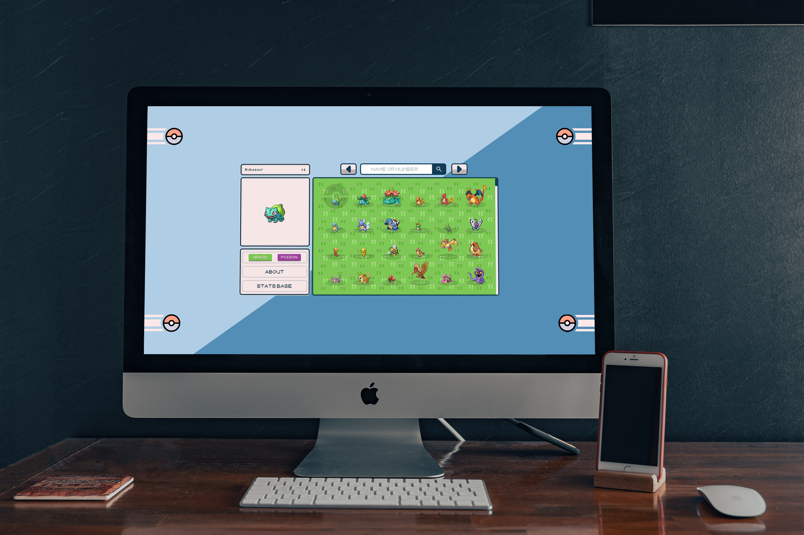

# Pokedex
O projeto foi realizado com base em aprimorar meus conhecimentos de javascript e conhecer melhor sobre as API, o design foi baseado no bau de pokemon.

## Layout

## *Tecnologias*
> Html / Css / JavaScript / Boostrap

[⭐ Acesse a pagina clicando aqui ⭐](https://robertodev3.github.io/pokedex)
